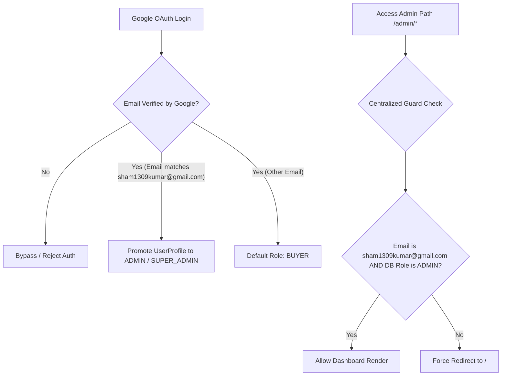
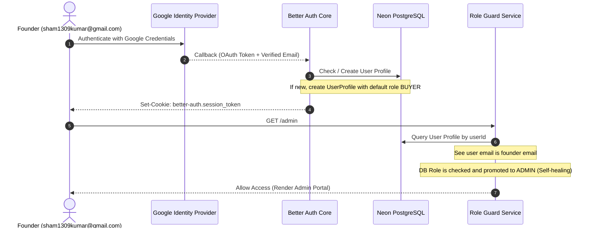
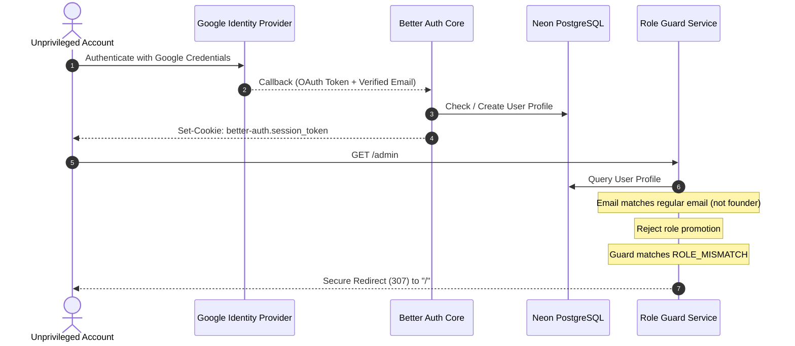

# Founder-Only Google OAuth Admin Security Architecture

This document outlines the security-hardened authentication and authorization architecture designed to lock down administrator privileges in the Velvet Lane marketplace.

---

## 1. Security Architecture Diagram

---

## 2. Authentication & Authorization Flow

### A. Authentication Sequence (Google OAuth)

### B. Access Denied Sequence (Unprivileged Account)

---

## 3. List of Modified Files

* **[auth.ts](file:///c:/Users/asus/OneDrive/DTS/velvet/src/lib/auth.ts)**: Modified user creation callback hooks so new accounts created under the database adapter default strictly to the `BUYER` role. The `ADMIN` role is allocated *only* if the incoming OAuth verified email matches the founder's email exactly.
* **[role.service.ts](file:///c:/Users/asus/OneDrive/DTS/velvet/src/lib/auth-services/role.service.ts)**: Implemented self-healing role check. Whenever a profile lookup is performed, if the authenticated email is `sham1309kumar@gmail.com`, it automatically repairs the database profile status and promotes it to `ADMIN` if it was not already.
* **[admin-auth.ts](file:///c:/Users/asus/OneDrive/DTS/velvet/src/lib/admin-auth.ts)**: Hardened `verifyAdminSession` by removing developer fallback backdoors (which promoted developer profiles to ADMIN or bypass checks in non-production environments). It now performs a zero-tolerance email and database role verification.
* **[AdminLoginForm.tsx](file:///c:/Users/asus/OneDrive/DTS/velvet/src/app/admin/login/AdminLoginForm.tsx)**: Replaced credentials form (email, password, OTP) with a single, secure Google OAuth action button ("Continue with Google") to prevent any local login attempts or brute-force requests.
* **[auth-guard.test.ts](file:///c:/Users/asus/OneDrive/DTS/velvet/src/tests/auth-guard.test.ts)**: Implemented verification specs testing founder self-healing promotion and blocking unauthorized Google emails.

---

## 4. Removed Vulnerabilities

| Vulnerability ID | Description | Resolution |
| :--- | :--- | :--- |
| **VULN-01** | Developer Fallback Bypass in `verifyAdminSession`. | Removed all non-production bypass mechanisms that automatically promoted developer users or created ADMIN profiles automatically. |
| **VULN-02** | Local Credentials login for Admins. | Removed password, OTP, and local credentials inputs from the Admin Login page, replacing it with secure, Google-only OAuth. |
| **VULN-03** | Privilege Escalation via Sign-up/Onboarding. | Audited signup logic to ensure no client parameter or API endpoint can specify a role change to `ADMIN`. |

---

## 5. Verification Results

All unit tests ran successfully with `tsc` compile checks passing with **0 errors**:
* `src/tests/auth-guard.test.ts`: Passed (8 tests)
* `src/tests/seller-verification.test.ts`: Passed (4 tests)
* `src/tests/auth.test.ts`: Passed (6 tests)
