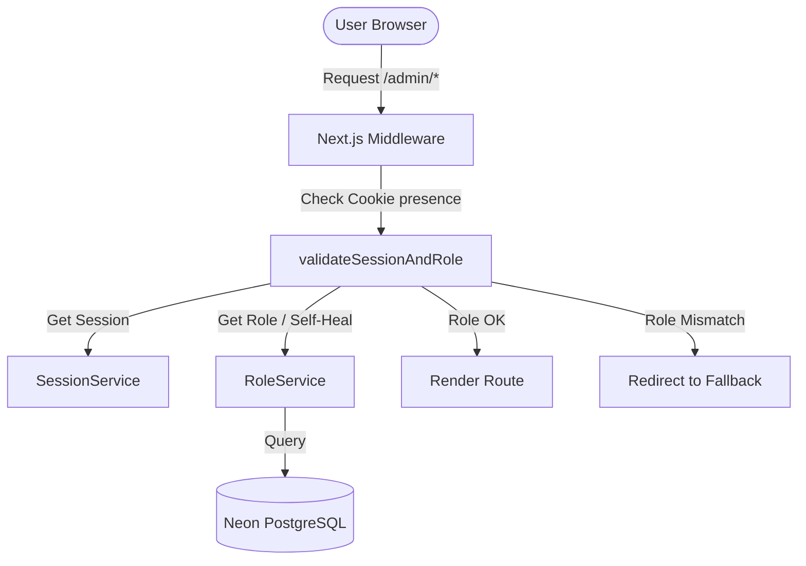
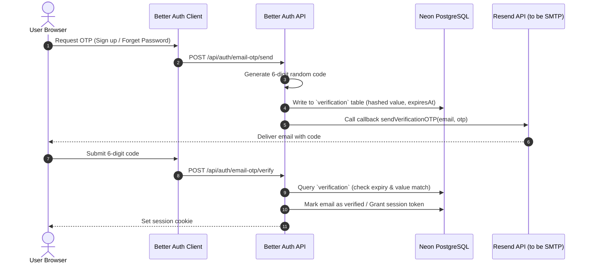

# Technical Audit: Authentication & Email Infrastructure

This report details the forensic analysis of Velvet Lane’s authentication, OTP, and email delivery systems. It outlines the current state and presents a design strategy for migrating from the third-party **Resend** service to a custom **SMTP** infrastructure.

---

## 1. Executive Summary

Velvet Lane relies on **Better Auth** linked via a Prisma adapter to a Neon PostgreSQL database. Emails and OTP codes (for password resets and signup verification) are currently routed through the **Resend API SDK** using direct HTTP endpoint calls.

To achieve cloud provider independence, reduce operational costs, and improve delivery control, Velvet Lane is planning to transition to a **custom SMTP-based email transport**. This audit acts as a technical blueprint to ensure zero service disruption during the migration.

---

## 2. Current Authentication Architecture



### A. Lifecycle Stages

1. **Session Storage**: Managed by Better Auth. Sessions are stored in the `session` table of the database and mapped to the browser via a cookie.
2. **Cookie Handling**:
   * Standard: `better-auth.session_token`
   * Secure: `__Secure-better-auth.session_token` (in production)
3. **Session Validation**: Enforced at three levels:
   * **Middleware** (`src/middleware.ts`): Performs a shallow check for the presence of session cookies.
   * **Route Guards** (`src/lib/auth-services/guard.ts`): Server-side validation of session tokens and database roles.
   * **Page Level Layouts**: Active layouts (like `/admin/layout.tsx` or `/seller/dashboard/page.tsx`) call `validateSessionAndRole` to block unprivileged access.

---

## 3. Current Email Infrastructure

Velvet Lane currently has **no unified email service abstraction**. Email dispatch is split across two separate pathways:

1. **Better Auth Authentication Hooks**: Integrated directly into `src/lib/auth.ts`. It instantiates `new Resend(process.env.RESEND_API_KEY)` and triggers inline API calls to send password-reset URLs and verification codes.
2. **Operational Alerts Wrapper**: Located in `src/lib/resend.ts`. This file exposes `sendFounderAlert()` to notify administrators of system-critical events (such as escrow failures or courier webhook issues).

### A. Template Management
Templates are centralized in `src/lib/email-templates.ts` as HTML template functions:
* `getVerificationEmailHtml({ code, expiresInMinutes })`
* `getPasswordResetEmailHtml({ resetUrl, code, expiresInMinutes })`
* `getWelcomeEmailHtml({ name, role })`
* `getAccountLockoutEmailHtml({ name, ipAddress, time })`

---

## 4. OTP Flow Analysis



### A. Database Schema
Better Auth leverages the `Verification` model defined in `prisma/schema.prisma`:
```prisma
model Verification {
  id         String   @id
  identifier String   // Target email address
  value      String   // Hashed token or OTP value
  expiresAt  DateTime // Expiry time (defaults to 5 minutes)
  createdAt  DateTime @default(now())
  updatedAt  DateTime @updatedAt

  @@index([identifier])
  @@map("verification")
}
```

---

## 5. Better Auth Analysis

Better Auth runs as a unified endpoint handler mounted at `/api/auth/[...all]/route.ts`. 

```text
Better Auth Configuration (src/lib/auth.ts)
  ├── Database Adapter: Prisma (prismaAdapter)
  ├── Auth Methods: Email/Password, Google OAuth
  └── Plugins:
        └── emailOTP (Generates OTP codes and forwards them to sendVerificationOTP)
```

---

## 6. Dependency Map

```text
[Better Auth (auth.ts)]
  ├── depends on ── [Prisma Client (prisma.ts)]
  ├── depends on ── [Resend SDK (resend)]
  ├── depends on ── [Email Templates (email-templates.ts)]
  └── consumed by ── [API Route Handler (/api/auth/[...all])]
  └── consumed by ── [Server Action: logout.action.ts]

[Resend Wrapper (resend.ts)]
  ├── depends on ── [Resend SDK (resend)]
  └── consumed by ── [Escrow Release System (escrow-release.ts)]
  └── consumed by ── [Courier Webhooks (icarry/webhook)]
  └── consumed by ── [Returns Notifications (returns/services/notifications.ts)]
```

---

## 7. File Inventory

| File Path | Component Category | Purpose |
| :--- | :--- | :--- |
| `src/lib/auth.ts` | Auth Config | Better Auth server instance and provider configurations. Handles direct Resend integration for auth. |
| `src/lib/auth-client.ts` | Auth Client | Frontend client wrapper configured with the `emailOTPClient` plugin. |
| `src/lib/email-templates.ts`| Email Templates | Pure HTML templates for user emails. |
| `src/lib/resend.ts` | Email Utility | Operational alert client used to notify the founder of exceptions. |
| `src/app/api/auth/[...all]/route.ts` | API Route | Wildcard route forwarding requests to Better Auth API. |
| `src/actions/logout.action.ts` | Server Action | Triggers atomic sign-out and cookie deletion. |
| `src/middleware.ts` | Middleware | Checks cookie presence for layout protection. |

---

## 8. Environment Variable Audit

| Variable Name | Purpose | Migration Classification |
| :--- | :--- | :--- |
| `BETTER_AUTH_SECRET` | Auth Encryption Key | **Required** (Keep as-is) |
| `NEXT_PUBLIC_APP_URL` | Frontend Host URL | **Required** (Keep as-is) |
| `BETTER_AUTH_URL` | Better Auth Base API URL | **Required** (Keep as-is) |
| `RESEND_API_KEY` | Resend API authorization token | **Unused/Remove** |
| `EMAIL_FROM` | Dispatch sender address | **Replace** (Convert to SMTP sender) |
| `RESEND_FROM_EMAIL` | Alert sender address | **Replace** (Convert to SMTP sender) |
| `FOUNDER_EMAIL` | System alert recipient | **Required** (Keep as-is) |
| `SMTP_HOST` | Custom SMTP server hostname | **NEW** (Required for custom SMTP) |
| `SMTP_PORT` | Custom SMTP port (e.g. 587, 465) | **NEW** (Required for custom SMTP) |
| `SMTP_USER` | SMTP authentication username | **NEW** (Required for custom SMTP) |
| `SMTP_PASSWORD` | SMTP authentication password | **NEW** (Required for custom SMTP) |
| `SMTP_SECURE` | Encryption configuration (SSL/TLS)| **NEW** (Optional) |

---

## 9. Current Email Flow

```text
[Auth Action] ──> Triggers sendVerificationOTP() ──> Instantiates Resend Client ──> Calls Resend API ──> Email Sent
[System Error] ──> Triggers sendFounderAlert() ──> Instantiates Resend Client ──> Calls Resend API ──> Email Sent
```

---

## 10. Migration Impact Assessment

| File Path | Impact Classification | Migration Action Details |
| :--- | :--- | :--- |
| `package.json` | Minor modification | Uninstall `resend`, install `nodemailer` and `@types/nodemailer`. |
| `src/lib/auth.ts` | Minor modification | Replace `resend.emails.send` inside `sendResetPassword` and `sendVerificationOTP` with the new unified `EmailService.send()`. |
| `src/lib/email-templates.ts`| Reuse without modification| The template generator functions are clean HTML and can be reused directly. |
| `src/lib/resend.ts` | **Delete** | The alert delivery wrapper is no longer required and will be superseded by the unified EmailService. |
| `src/lib/email.service.ts` | **NEW** | Create a unified `EmailService` utilizing a pooled Nodemailer transporter with connection testing. |
| `src/modules/returns/services/notifications.ts` | Minor modification | Change `import { sendFounderAlert } from "@/lib/resend"` to use `EmailService.sendAlert()`. |
| `src/lib/escrow-release.ts` | Minor modification | Change import and call to use `EmailService.sendAlert()`. |
| `src/app/api/icarry/webhook/[secret]/route.ts` | Minor modification | Change import and call to use `EmailService.sendAlert()`. |

---

## 11. Proposed SMTP Architecture

A centralized `EmailService` will encapsulate all SMTP configuration, connection pooling, and error handling.

```text
src/lib/email.service.ts
  ├── Transporter: Nodemailer Pooled SMTP Transporter
  ├── Methods:
  │     ├── send(to, subject, html) - Basic dispatch
  │     ├── sendAlert(subject, html) - Founder alert redirect
  │     └── verifyConnection() - Verification helper
```

* **Connection Pooling**: Nodemailer will configure pooling to prevent opening and closing TCP connections for every single email, minimizing transactional overhead.
* **Fallback Mode**: In local development environments, if SMTP environment variables are missing, the service will mock-log emails directly to the stdout/terminal rather than failing.

---

## 12. Risk Assessment

* **Risk 1: SMTP Transaction Latency (High)**: SMTP handshakes are slower than HTTP requests to Resend. Direct calls in request cycles could delay user page responses.
  * *Mitigation*: Ensure email dispatches inside Next.js are executed asynchronously (not awaited in the critical path).
* **Risk 2: Credentials Disclosure (Medium)**: Storing plaintext SMTP credentials in environment files.
  * *Mitigation*: Restrict read access to `.env` variables and ensure they are parsed securely inside `EmailService` configuration.
* **Risk 3: Connection Timeout and Starvation (Low)**: Cloud database latency can interact with SMTP failures.
  * *Mitigation*: Implement automatic connection recovery and socket timeouts (e.g. 5 seconds) on the Nodemailer transport pool.

---

## 13. Phased Migration Roadmap

```text
Phase 1: Discovery & Audit (COMPLETE)
  └── Complete this architecture analysis report.

Phase 2: SMTP Client Installation
  └── Run npm install nodemailer & npm install --save-dev @types/nodemailer.
  └── Uninstall the legacy resend dependency.

Phase 3: Environmental Setup
  └── Provision SMTP server details (host, port, credentials).
  └── Configure variables in local and production environments (.env).

Phase 4: Build EmailService Class
  └── Create src/lib/email.service.ts with connection pooling.
  └── Support fallback console logging for development modes.

Phase 5: Refactor Better Auth Hooks
  └── Update src/lib/auth.ts to direct SMTP alerts.

Phase 6: Update Operational Alerts
  └── Refactor returns, shipping webhooks, and escrow alerts to use the new service.
  └── Delete legacy src/lib/resend.ts.

Phase 7: End-to-End Verification
  └── Run mock and integration tests.
  └── Run compiler check (npx tsc --noEmit).
```
